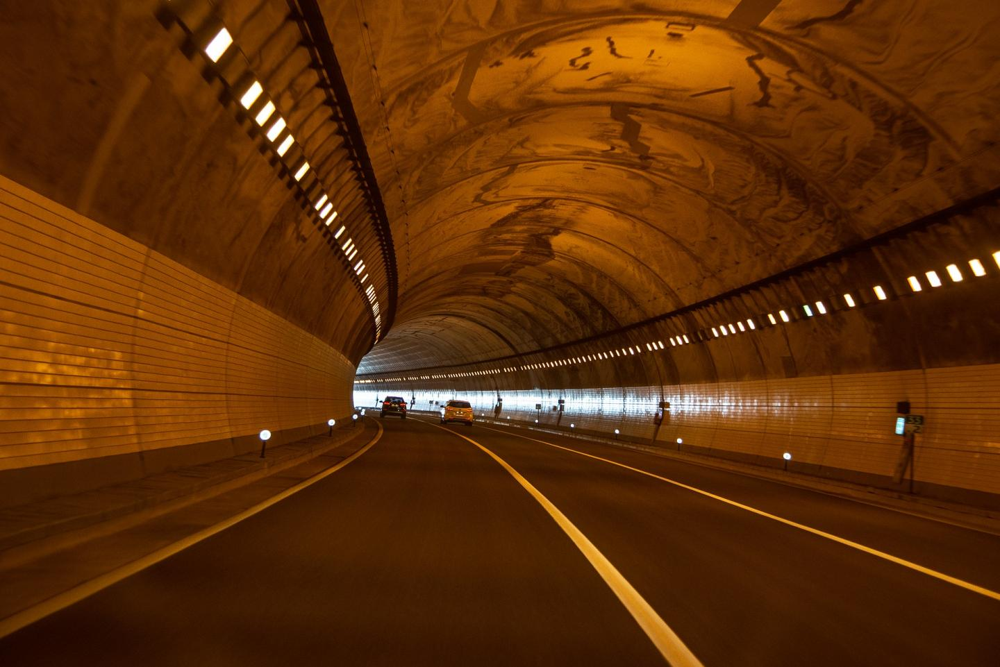

# Câmaras de eco

## Som e isolamento

A câmara de eco acústica se trata de um invólucro oco no qual os sons reverberam por suas paredes. Por sua vez, a reverberação é um fenômeno caracterizado pela **reflexão** do som de forma reiterativa pelos obstáculos presentes no ambiente. Todos nós já experienciamos esse fenômeno em algum momento. Quando gritamos em uma caverna e ouvimos nossa própria voz acenando de volta. Quando falamos em uma sala que foi esvaziada para mudança e conseguimos ouvir o final das palavras que acabamos de dizer. Quando buzinamos em um túnel no meio de uma noite chuvosa. Aos sons emitidos por nós que ouvimos em sequência em situações como as descritas damos o nome de **eco**. 

O eco é um fenômeno físico do mundo real e sabemos identificar ele facilmente em nosso cotidiano. Em uma quantidade razoável de momentos estamos em palco com a sensação de ouvir os sons que nós mesmos emitidos em ambientes como os que aqui abordamos, e uma emoção fortemente associada com esses momentos é a de estar longe de todos, ou até mesmo sozinho. A sensação de **isolamento**.

## Câmaras de eco ideológicas e sua ocorrência em redes sociais.

No estudo dos meios de comunicação, uma câmara de eco ideológica é um termo metafórico para um ambiente no qual ideias, crenças, opiniões e informações são amplificadas, reforçadas, repetidas e refletidas em um sistema comunicativo fechado. Tal ambiente possui semelhanças notáveis com as câmaras de eco acústicas, o que levou elas a compartilhem do mesmo nome por meio de uma metáfora.

Tais ambientes são caracterizados pela falta de diversidade opinativa e pela existência de ideias dominantes que reverberam pela extensão da câmara, criando um sistema ideológico relativamente fechado e viesado, o qual só ouve o que ele mesmo emite. Imaginemos por exemplo um grupo de pessoas que interagem entre si e compartilham de ideologias muito semelhantes, com opiniões formadas e centradas em torno dessas ideias homogêneas. Elas conversam entre sí, formam teorias, discutem conceitos e argumentam baseando-se no sistema ideológico que lhes é comum. Imaginemos também, que quando alguém com ideais diferentes interage com esse círculo de pessoas, expondo tal diferença, elas imediatamente repelem tal pessoa e seus conceitos, já que são estranhos para seu sistema opinativo. Dessa forma, o grupo mantém um sistema ideológico estável, quase inerte e no qual dificilmente outras ideias são bem vindas. Cria-se assim um sistema isolado com sua própria realidade, muitas vezes alheia ao que ocorre do lado de fora. Tal sistema é o que poderíamos chamar de uma câmara de eco.

Diferentemente do fenômeno do eco acústico, o fenômeno do **eco ideológico** muitas vezes é de difícil detecção, sendo que as condições necessárias para que ele ocorra são relativamente sutís. Voltando ao exemplo do túnel, quando ouvimos o som da buzina de nosso próprio automóvel ecoado, rapidamente sabemos dizer que se trata do eco, afinal, as condições necessárias são facilmente percebidas: estamos em um ambiente fechado e com obstáculos como outros carros e as próprias paredes, o som que ouvimos em seguida é idêntico ao que acabou de ser emitido com excessão de pequenas diferenças de reverberação e caso seja muito diferente, sabemos que não se trata do som emitido pelo nosso carro, mas sim o som emitido por outro agente no sistema, como o grito de um motorista zangado \(que por sua vez terá seu respectivo eco\). Assim facilmente tomamos consciência da ocorrência do eco e sabemos que está ocorrendo. Infelizmente, não é tão simples no caso das câmaras de eco ideológicas. Nelas, as condições necessárias são pouco evidentes e tomar consciência de que está na presença de um delas muitas vezes não é trivial.

O exemplo do grupo de pessoas que comentamos anteriormente acaba por não ser muito difícil de se detectar, já que em interações do dia a dia tanto pessoas de dentro do grupo quanto de fora acabariam percebendo a situação. Porém, em um ambiente virtual como uma **rede social**, tal fenômeno não é tão fácil de se detectar. E é exatamente nesse ambiente que as câmaras de eco prevalecem, tomam escala e se tornam interessantes tendo-se em vista que seus efeitos são muito mais socialmente perceptíveis.

Obs.: a partir desse ponto, quando o termo "câmara de eco" for utilizado, estamos nos referindo ao fenômeno comunicativo \(câmara de eco ideológica\), a não ser que seja evidente no texto o contrário.

## Como câmaras de eco se formam.

Estes ambientes comunicativos fechados em redes sociais têm chamado muito a atenção de pesquisadores nas áreas da comunicação, sociologia, política e ciência da computação devido efeitos que eles podem ter no mundo não virtual. Não só o seu mecanismo como seus reflexos não são de fácil compreensão e demandam estudos em diversas áreas do conhecimento que, por mais que ainda não apresentem uma total compreensão do fenômeno, chegaram à diversas conclusões importantes sobre como ele funciona. 

#### O papel das redes sociais.

Como comentamos brevemente, as câmaras de eco tem sua escala e influência amplificada nas redes sociais. Isso se deve ao fato de como a maioria das redes que mais utilizamos hoje opera, como seus mecanismos de interação funcionam e como nós percebemos esse ambiente virtual

A percepção do ambiente é uma questão importante aqui. Redes sociais \(principalmene as não profissionais e mais casuais\) são muitas vezes tratadas como **ambientes fora da realidade**, separados do que nós classificamos como "vida real". Isso afeta profundamente a relação que temos com elas, pois muitas vezes não a tratamos como constituinte do mundo real, nos levando à ações que muitas vezes não performaríamos na dita realidade. Se isolar em um grupo de pessoas com a mesma visão e mostrar-se reativo e aversivo à visões diferentes é muito mais simples em um mundo que julgamos paralelo com supostas consequências paralelas do que em mundo que julgamos real com supostas consequências reais e esse simples fato já nos ajuda a entender o papel dessas redes na formação de câmaras de eco: as pessoas nem sempre se comportam da mesma forma no plano online e no plano offline e essas diferenças de comportamento, impulsionadas pela forma que as redes funcionam, faz com que a ocorrência de sistemas de interação fechados seja amplificada em ambientes virtuais.

#### Viés de confirmação.

Todo ser humano possui crenças. Dessas crenças surgem valores, opiniões, ideias e uma visão de mundo que é praticamente única para cada um. Um sistema de crenças é importante para nós e está atrelado com a forma lógica de escolher como iremos agir diante de uma situação qualquer. Esse sistema é criado conforme nos expomos e andamos no palco do cotidiano. Podemos incorporar ou rejeitar ideias novas, compor nosso sistama antigo com o novo ou rejeitá-lo completamente e reestruturar ele do zero. 

É de se esperar, porém, que o fenômeno de rejeição do novo costuma ser mais frequente do que outros. Afinal, muitas vezes temos que ir contra o que acreditamos por muito tempo para aceitar uma nova crença e isso pode gerar incertezas em relação à nossas condutas antigas. 

O viés de confirmação é um viés cognitivo que tem sua raíz na inércia de aceitar crenças novas. Basicamente, o viés de confirmação ocorre quando tendemos a pesquisar, se lembrar ou interpretar informações novas de maneira à corroborar com crenças que já tínhamos, ou seja, quando existe a tendência de nos relacionarmos com informações novas priorizando o que já tínhamos como hipóteses iniciais. Muitas vezes ignorando informações que vão de desencontro com essas hipóteses ou simplesmente encontrando argumentos infundados para confrontar tais informações a fim de preservar nossas crenças. Tal comportamento normalmente tem origens emocionais e não costuma ter traços de racionalidade fundados, configurando-se como uma falha de raciocínio indutivo, no qual não induzimos conclusões em acordo com as informações que nos são apresentadas.

Redes sociais são ambientes que nos fornecem uma quantidade absurda de informações. Seja em formato de notícias, opiniões, memes ou outras formas, o fato é que temos um contato com um número extremo delas nesses ambientes. Assim sendo, é natural que o viés de confirmação possa se manifestar mais intensamente sob tais condições, levando-nos a ações diversas que são possíveis em redes sociais. Entre elas, filtrar o nosso feed, ou seja, selecionar as vozes que queremos ouvir, mesmo que isso ocorra sem movermos um dedo.

#### Os feeds de informação.

Feeds das redes sociais apresentam mecanismos muito interessantes do ponto de vista de formação de câmaras de eco. Entre eles, temos os filtros que nós mesmos podemos aplicar à ele.

É muito simples em um ambiente como uma rede social de escolher qual tipo de conteúdo queremos ver em nosso feed. Podemos escolher as pessoas que seguimos ou somos "amigos" e um piscar de olhos. Quando vemos o que nos gera desconforto, como uma opinião que não concordamos, podemos facilmente retirar a pessoa que a proferiu de nosso "círculo de amizades" ou simplesmnete silenciá-las. Assim, passamos a estar conectados apenas com as pessoas que escolhemos estar e a consumir informações apenas dos meios que preferirmos. É muito comum utilizarmos esse tipo de ferramenta, afinal, muitas vezes usamos as redes sociais como um momento de relaxamento e descontração e não queremos que esse momento seja interrrompido por desconfortos. Então, simplesmente tiramos de nosso feed o que não queremos ver, de  forma intencional e consciente.

Outro fator que é a proridade com que o feed te mostra informações. Sabemos que as redes sociais nos apresentam informações em uma certa ordem, afinal, o feed tem uma ordem e acompanhamos o seu desenrolar enquanto estamos online. Essa ordem não é aleatória e está relacionada com o seu **engajamento** na rede. Claro que os algoritmos desses ambientes são projetados com a intenção de que você passe o máximo de tempo possível conectado, afinal, é assim que eles se tornam ambientes rentáveis. Já que não pagamos para usufruir deles, essas plataformas têm sua receita provinda de propaganda e anúncios, os quais você tem contato conforme utiliza a rede. Assim sendo, a forma que seu feed funciona também tem como objetivo manter você conectado, e para isso os algoritmos responsáveis precisam entender coo você funciona. Será que você costuma sair da rede após se deparar com algum tipo de conteúdo? Será que você interage mais com determinado tipo de opinião? Observando nossos padrões de utilização do ambiente, tais algoritmos priorizam o que você irá ver no feed. Então mesmo que você siga uma pessoa com quem compartilha uma imensa discordâcia, pode ser que raramente você veja suas publicações, já que elas podem estar relacionadas com ações de sua parte que limitam seu tempo conectado.

Apenas esses dois simples mecanismos já são de extrema importância para facilitar a formação de câmaras de eco em ambientes virtuais. Por meio deles, é comum que o usuário se isole de certo tipo de conteúdo e passe a integrar um sistema que apenas ecoa o que vãi de encontro com suas ideias e crenças, ou pelo menos um sistema que priorize tal tipo de informação.

#### O mecanismo e sua sutileza.

A forma que essas plataformas operam é extremamente sutil e não é trivial detectar que podemos estar em uma câmara de eco, ou seja, isolado de outros tipos de ideias e pessoas que pensam de forma diferente. As pequenas ações são cumulativas: deixamos de seguir um amigo com visão política diferente da nossa, passamos a acompanhar meios de informação \(oficiais ou não\) que refletem nossas crenças, seguimos apenas os políticos que acreditamos ter uma certa visão de mundo e assim por diante, o algoritmo percebe que você tem menos engajaento com opiniões que não concorda e assim por diante. Essas pequenas interações podem levar ao isolamento do usuário em uma câmara de eco sem mesmo que ele perceba. Exatamente por ter-se uma falsa impressão que tudo que se está vendo no feed é o que há para se ver na rede inteira, é difícil percebermos que estamos isolados. Como sabemos que estamos presos se não conseguimos ver os muros ou ouvir as pessoas que estão do outro lado? A rede social passa a integrar um arquipélogo comunicativo no qual uma ilha não vê muito da outra, o que leva à consequências interessantes.

## Quais são as consequências desses arquipélagos comunicativos?

Vimos um pouco dos mecanismos responsáveis pela formação de câmaras de eco. Por ser um fenômeno extremamente complexo, muitos fatores o influenciam e compreender como ele funciona é uma constante junção de pequenas peças de conhecimento. Porém, quais são os efeitos gerados pela formação desses ambientes? Comentamos algumas consequências imediatas como o isolamento, mas muitas outras, diretas e indiretas, podem ser pontuadas.

#### Homogeneização ideológica e polarização.

Estudos como os levados pelo Observatório e Mídas Sociais \(OSoMe na sigla em inglês\) da Universidade de Indiana mostram que em redes sociais existe a tendência à polarização em interações de conversa e uma baixa diversidade de notícias consumidas pelos usuários no geral. Isso se deve à dois fatores principais: a **segregação da rede** e a **polarização da opinião**, as quais estão conectadas e se retroalimentam. As câmaras de eco corroboram fortemente para a segregação da rede, ou seja, a quebra dela em redes menores com poucas conexões. Isso gera uma baixa diversidade de informações consumidas pelo usuário imerso nesse sistema e, devido à fatores humanos como a homofilia \(a tendência de formar laços com pessoas parecidas\) e a influência social \(a tendência a se tornar mais semelhante à uma pessoa como resultado de interações sociais\), ocorre uma tendência à firmação de ideias dominantes e homogêneas no espaço compreendito pela câmara. Esse fator leva à novas polarizações e novas segregações, diminuindo a diversidade de informações que um único usuário é exposto. Dessa forma, criam-se ambientes em que usuários se veem imersos em ideias muito parecidas com as suas e as quais tendem a se manifestar cada vez mais como opiniões polarizadas.

#### Propagação de desinformação.

Um efeito menos evidente das câmaras de eco é na influência que elas tem em amplificar a propagação de desinformação. Para entender como isso ocorre temos que nos considerar três fatores: a criação de ambientes extremamente polarizados e de opiniões extremamente homogêneas que as câmaras de eco geram, o viés de confirmação e a propagação de desinformação em uma rede.

Um ambiente extremamente homogênio tende a agrupar pessoas que possuem visões de mundo semelhantes, como já discutimos no decorrer deste texto. Imaginemos então que uma pessoa tem acesso à uma informação ou notícia de cunho duvidoso e infundado. Se a informação concorda com suas crenças pode ocorrer da pessoa envolvida ter uma tendência à compartilhar aquela informação, mesmo que ela tenha traços de não ser verdadeira ou ser manipulada de alguma forma. O fenômeno do viés de confirmação mostra que não só isso é possível como pode ocorrer considerávelmente. Então essa pessoa compartilha em sua rede tal informação. Por sua vez, cada pessoa conectada à anterior é exposta ao conteúdo duvidoso. Como essas pessoas, por consideração inicial, estão em um ambiente fechado comunicativo e extremamente homogeneizado, há altas chances de ocorrer o mesmo processo que caracterizou o comportamento da primeira pessoa com as pessoas seguintes na rede. Dessa forma, rapidamente um rumor ou desinformação ganha proporções astronômicas em um ambiente caracterizado por uma câmara de eco, aumentando a probabilidade dessa informação atingir mais pessoas e aumentando a chance de ele ser compartilhado ainda mais. Perceba que claramente nem todos irão compartilhar a informação, mas o alcance dela será amplificado, podendo chegar à mais pessoas que possam ter simpatia por tal informação mesmo que ela não tenha fundamento.

Assim sendo, ambientes criados poe câmaras de eco possuem topologia extremamente favorável à propagação de desinformação, culminando muitas vezes em fenômenos mais sérios como disseminação massiva de rumores e inverdades.

#### Consequências onlife.

## Um mundo não tão conectado.

## Fontes

Conteúdo textual:

* Artigo sobre aceleramento da formação de câmaras de eco em ambientes virtuais: Social Influence and Unfollowing Accelerate the Emergence of Echo Chambers - [https://link.springer.com/article/10.1007/s42001-020-00084-7](https://link.springer.com/article/10.1007/s42001-020-00084-7)
* Definições gerais de câmaras de eco: [https://pt.wikipedia.org/wiki/C%C3%A2mara\_de\_eco](https://pt.wikipedia.org/wiki/C%C3%A2mara_de_eco)
* Definições gerais de viés de confirmação: [https://pt.wikipedia.org/wiki/Vi%C3%A9s\_de\_confirma%C3%A7%C3%A3o](https://pt.wikipedia.org/wiki/Vi%C3%A9s_de_confirma%C3%A7%C3%A3o)
* Site do OSoMe: [https://osome.iu.edu/highlights/](https://osome.iu.edu/highlights/)

Imagens:

* Túnel: créditos da imagem: Pixabay/wal\_172619

