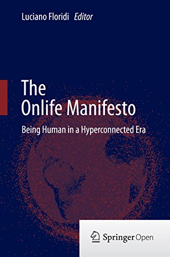

# Mundo Onlife

## O que é Onlife

De acordo com o professor [Luciano Floridi](https://en.wikipedia.org/wiki/Luciano_Floridi),

> Onlife é a nova existência na qual a barreira entre real e virtual caiu, não há mais diferença entre 'online' e 'offline', mas há precisamente uma 'onlife': a nossa existência, que é híbrida como o habitat dos manguezais

Essa palavra, cunhada pelo professor, já é usada por empresas e governos para descrever a sociedade em que vivemos. A ideia é que já não faz mais sentido separar o online do offline, existindo uma fronteira muito tênue entre essas realidades.

Luciano começou com esse termo lançando o documento intitulado _The Onlife Manifesto: being human in a hypeconnected era_, em fevereiro de 2013. O texto, resultado das pesquisas e discussões desenvolvidas no âmbito do projeto _Onlife Iniciative_, foi elaborado por um grupo de pesquisadores liderados pelo professor.

O Manifesto afirma que as Tecnologias de Informação e Comunicação \(TICs\) nos afetam de inúmeras maneiras importantes, impactando em nossa autoconcepção e visão da realidade e a forma como interagimos com os outros e com a própria realidade. Ele cita quatro mudanças importantes que levaram a este cenário: a distinção difusa entre vida real e virtual e entre humanos e máquinas; informações excessivas ao invés de insuficientes; e uma nova primazia das interações e redes sobre as coisas individuais.

As incríveis tecnologias que inventamos, disse o professor, muitas vezes se desenvolvem mais rapidamente do que nossa capacidade de administrá-las, e os adultos não são melhores e talvez até menos preparados do que os jovens para a realidade da "vida onlife".

## Redes sociais e o Onlife

O mais interessante é analisar como as redes sociais ajudam a perpetuar ainda mais o funcionamento do Onlife. Desde a forma os nossos perfis nessas redes acabam funcionando para fazer certas ações no mundo real, como procurar emprego, até a forma de como algo aparentemente pequeno postado na internet consegue atualmente repercurtir de uma maneira surpreendente no mundo offline. 

### Caso de estudo: Política

A política é provavelmente um dos casos mais fáceis de perceber como a rede social consegue perpetuar a ideia do mundo Onlife. Um [estudo da Pew Research](https://www.journalism.org/2020/07/30/americans-who-mainly-get-their-news-on-social-media-are-less-engaged-less-knowledgeable/) afirma que cerca de um em cada cinco adultos norte-americanos recebe suas notícias políticas principalmente através da mídia social. O estudo também conclui que aqueles que recebem suas notícias políticas principalmente através da mídia social tendem a estar menos bem informados e mais expostos às alegações não comprovadas de que as pessoas que recebem suas notícias de fontes tradicionais.

### Caso de estudo: Comércio

Embora a tecnologia tenha ampliado nossas possibilidades de aprender, disse Luciano Floridi, este potencial mal é realizado, com informações sendo aproveitadas com mais frequência para fins comerciais.

Cada vez mais temos a companhia de algoritmos que identificam nossos padrões em redes sociais e conseguem nos recomendar roupas para vestirmos e música para ouvirmos. O comércio digital e offline também já está em uma linha muito tênue, se encontrando no Onlife como um todo.

## Fontes

Luciano Floridi – Onlife - Being Human in a Hyperconnected Era - [https://www.youtube.com/watch?v=XhmTzqVx\_64](https://www.youtube.com/watch?v=XhmTzqVx_64)

FLORIDI, Luciano \(ed.\). _The Onlife Manifesto: being human in a hypeconnected era._ Springer Cham, 2015. Disponível em: [https://doi.org/10.1007/978-3-319-04093–6](https://doi.org/10.1007/978-3-319-04093-6)

"A era do Onlife, onde real e virtual se \(com\)fundem". Entrevista com Luciano Floridi - [http://www.ihu.unisinos.br/78-noticias/593095-luciano-floridi-vou-explicar-a-era-do-onlife-onde-real-e-virtual-se-com-fundem](http://www.ihu.unisinos.br/78-noticias/593095-luciano-floridi-vou-explicar-a-era-do-onlife-onde-real-e-virtual-se-com-fundem)

Ser humano e inteligência artificial: os próximos desafios do onlife. Entrevista com Luciano Floridi - [http://www.ihu.unisinos.br/78-noticias/604136-ser-humano-e-inteligencia-artificial-os-proximos-desafios-do-onlife-entrevista-com-luciano-floridi](http://www.ihu.unisinos.br/78-noticias/604136-ser-humano-e-inteligencia-artificial-os-proximos-desafios-do-onlife-entrevista-com-luciano-floridi)

Americans Who Mainly Get Their News on Social Media Are Less Engaged, Less Knowledgeable - [https://www.journalism.org/2020/07/30/americans-who-mainly-get-their-news-on-social-media-are-less-engaged-less-knowledgeable/](https://www.journalism.org/2020/07/30/americans-who-mainly-get-their-news-on-social-media-are-less-engaged-less-knowledgeable/)

