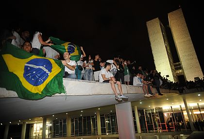

# Redes sociais como ferramentas de mobilização social

## Redes Sociais e mobilizações

As Redes sociais têm se tornado cada vez mais um aspecto primordial da convivência nas sociedades contemporâneas. Sabendo disso, e considerando alguns aspectos presentes nessas redes, como o parcial anonimato oferecido nelas e a considerável liberdade para expressar diversas opiniões dentro das plataformas, as mesmas se tornaram bons espaços para mobilizações sociais de diversas causas diferentes.

São incontáveis as situações recentes nas quais movimentos conseguiram organizar suas diversas demandas e realizar todo tipo de evento utilizando Facebook, Twitter e afins. Um exemplo notório dentro do próprio Brasil foi a série de protestos em decorrência ao aumento de 20 centavos na tarifa de ônibus em junho de 2013. Nesse caso, os protestos, inicialmente contando com alguns milhares de pessoas, a partir de chamados nas redes sociais, conseguiram superar o número de participantes das manifestações pelo impeachment do ex-presidente Fernando Collor de Mello, em 1992.

Outro contexto que foi extremamente beneficiado pelo advento das redes sociais foi o de eventos e convenções de comunidades de diversos tipos de hobbies e gostos diferentes. Um exemplo proeminente disso são grandes convenções de Videogames realizadas pelo mundo, como a E3, um evento internacional que é em grande parte advertido por meio das redes sociais e consegue reunir jogadores do mundo todo, alcançando a marca de 66 mil de visitantes em 2019.

Contudo, é importante ressaltar que tais mobilizações, inclusive pelos mesmos motivos que as tornam tão poderosas, podem ser extremamente danosas e, em certos casos, errôneas. É cada vez mais comum ouvir o termo “cultura de cancelamento” em qualquer rede social, que poderia ser traduzida como “uma maneira de amplificar a voz de grupos oprimidos e forçar ações políticas de marcas ou figuras públicas”. Esse tipo de mobilização, apesar de já ter tido bons frutos, em diversos casos gerou consequências extremamente negativas na vida de pessoas que não necessariamente cometeram algum crime ou que não mereceriam uma segunda chance, por vezes causando a perda do emprego e destruindo a vida social desses indivíduos.

**Fontes:**







\*\*\*\*

