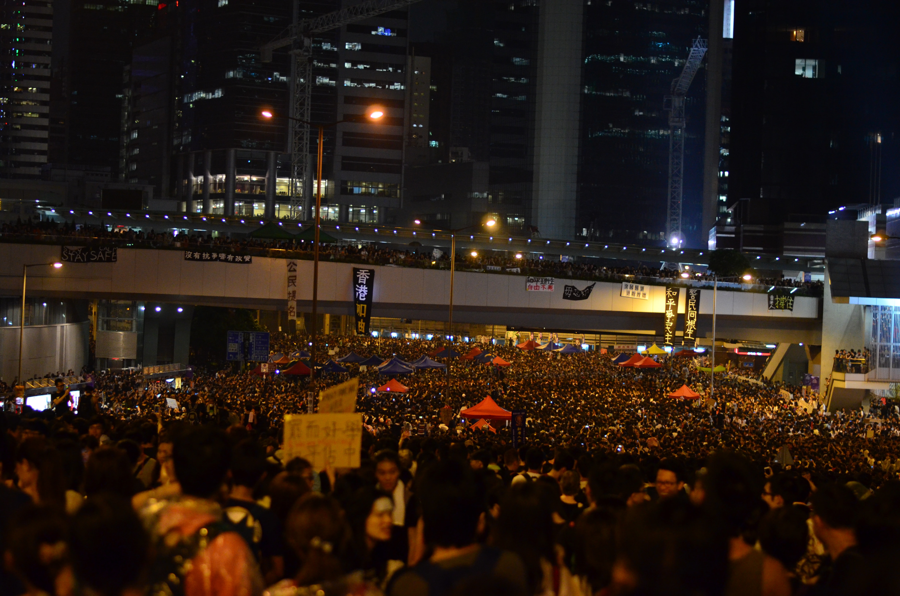
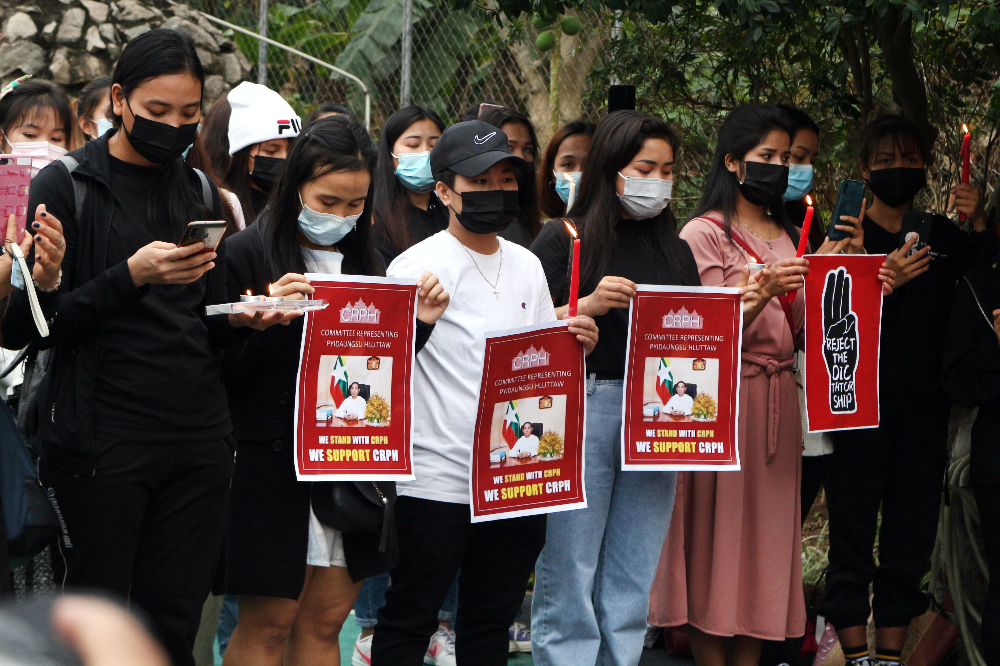

# Tecnologia como forma de resistência

## As necessidades da resistência

Governos autoritários, corporações gananciosas ou qualquer outro tipo de poder que impacte negativamente as pessoas instiga revolta, asco e consequentemente a união para lutar contra essa ameaça. Quando a situação chega nesse ponto, geralmente o poder tenta suprimir as revoltas usando qualquer meio que achar viável, seja por repressão física ou mental. E no momento em que os meios normais de manifestação são tirados dos cidadãos, eles buscam métodos alternativos para auxiliar sua resistência ou de veicular sua insatisfação. Um exemplo de método alternativo quando protestos nas ruas se tornam um risco para a vida, é a manifestação na internet que usando de algumas ferramentas podem garantir certo anonimato para os manifestantes, ou trazer informação inestimável durante a realização dos protestos. 

## Resistência contra governos

Em primeiro de fevereiro de 2021 um golpe de estado militar ocorreu em Mianmar, repentinamente a presidente eleita democraticamente foi aprisionada e foi declarado estado de emergência por um ano, atualmente o controle está na mão das forças armadas, chamada de Tatmadaw. Logo após o ocorrido começaram a ser organizados os primeiros protestos organizados pelos habitantes. E como o Facebook é o principal meio de comunicação no país, metade dos 53 milhões de habitantes usa a plataforma, o governo passou uma diretiva a todas as empresas de telefonia móvel e provedores de internet para que o Facebook e serviços relacionados fossem bloqueados por questão de "estabilidade". Em resposta ao rápido aumento da violência na repressão aos protestantes por parte do governo, resultando em várias mortes durante os protestos, o Facebook decidiu remover da plataforma vários perfis ligados às forças armadas, ação que foi bem recebida pelos manifestantes e foi descrito por um ativista contra o golpe como um "ato de solidariedade" e "um impulso de confiança".  As pessoas ainda utilizam uma ferramenta para burlar as restrições impostas pelo Tatmadaw para terem acesso as redes sociais, usando uma VPN manifestantes ainda podem se comunicar e utilizar a internet para coordenar protestos e fortalecer a resistência contra o governo.  

## Resistência contra grandes corporações

Em Junho de 2020 a campanha _Stop Hate for Profit_ lançou sua carta aberta na internet visando alcançar as empresas que contratam propagandas em grandes plataformas como o Facebook por exemplo, a ideia surge da crescente aparição de campanhas de ódio espalhadas pelas redes e como de uma forma ou de outra as plataformas acabam priorizando estas narrativas devido ao seu alto índice de engajamento mesmo que não diretamente. Inicialmente o projeto visava que as empresas parassem de divulgar nas plataformas pelo mês de Julho de 2020, porém com o tempo a ideia foi ganhando força e várias marcas aderiram a causa o que ocasionou na extensão do período inicial e na consolidação da campanha. Uma análise mais aprofundada das motivações levantadas pela organização por trás do movimento salienta a crescente insatisfação com as medidas adotadas contra a disseminação de discurso de ódio, no documento são apontadas as motivações iniciais como "incitação ao discurso de ódio, políticas contra desinformação inadequadas, os serviços para vítimas de assédio são inadequados, a proximidade das propagandas com conteúdo de ódio é negligente. Com o crescente apoio popular a campanha alcançou várias outras empresas, como destaque até grandes anunciantes como Coca-Cola, Pepsi, Adidas, Mozilla, entre outras. Esta campanha demonstra o quanto a nternet pode potencializar demandas de um grupo, quando o engajamento do público se torna muito elevado os grandes poderes não podem simplesmente ignorá-lo , e ações conjuntas em grande escala assim nunca conseguiriam tal engajamento sem um meio de comunicação tão descentralizado quanto a internet.  

## Fontes

[https://www.cnnbrasil.com.br/internacional/2021/02/04/golpe-em-mianmar-facebook-e-bloqueado-apos-ordem-governamental](https://www.cnnbrasil.com.br/internacional/2021/02/04/golpe-em-mianmar-facebook-e-bloqueado-apos-ordem-governamental)  
  
[https://www.bbc.com/portuguese/internacional-49338575](https://www.bbc.com/portuguese/internacional-49338575)  
  
[https://tecnoblog.net/349946/por-que-grandes-marcas-boicotam-anuncios-facebook/](https://tecnoblog.net/349946/por-que-grandes-marcas-boicotam-anuncios-facebook/)  
  
[https://www.adl.org/news/letters/an-open-letter-to-the-companies-that-advertise-on-facebook](https://www.adl.org/news/letters/an-open-letter-to-the-companies-that-advertise-on-facebook)  
  
[https://www.bbc.com/news/world-asia-55902070](https://www.bbc.com/news/world-asia-55902070)  
  
[https://time.com/5943151/facebook-myanmar-military-ban/](https://time.com/5943151/facebook-myanmar-military-ban/)  
  
[https://www.adl.org/who-we-are](https://www.adl.org/who-we-are)  

