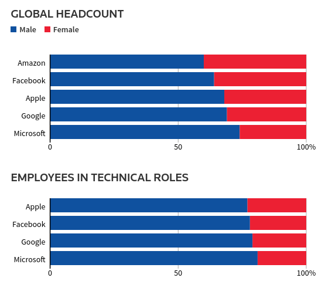

# Viés algorítmico

## Definição

O viés algorítmico descreve erros repetíveis e sistemáticos em um sistema de computador que criam resultados injustos, tais como privilegiar um grupo arbitrário de usuários em detrimento de outros. O viés pode surgir devido a muitos fatores, incluindo mas não limitado ao desenho do algoritmo ou ao uso não intencional ou imprevisto ou decisões relacionadas à forma como os dados são codificados, coletados, selecionados ou usados para treinar o algoritmo. O viés algorítmico é encontrado através de plataformas, incluindo mas não limitado aos resultados dos mecanismos de busca e plataformas de mídia social, e pode ter impactos que vão desde violações inadvertidas da privacidade até o reforço de viés social de raça, gênero, sexualidade e etnia.

## Como esse viés provavelmente surgiu

Esse tipo de algoritmo, como observado pela definição, tem a internet como um dos pontos centrais nessa discussão. É muito importante nos atentarmos a como a internet em si foi criada.

Nas origens do projeto da Internet, não se pensou em perceber algo como viés de algoritmo.

Os [protocolos iniciais](http://ccr.sigcomm.org/archive/1995/jan95/ccr-9501-clark.pdf) para a criação da internet pela DARPA foram:

> 1\) A comunicação na Internet não pode parar em função de falhas;
>
> 2\) Deve suportar múltiplos tipos de serviços e dispositivos;
>
> 3\) Deve acomodar múltiplas redes;
>
> 4\) Deve ser administrada de forma distribuída;
>
> 5\) O custo deve ser efetivo;
>
> 6\) Entrada de novos nós deve ser simples
>
> 7\) Recursos na rede devem facilmente identificáveis para responsabilização

Como podemos ver, evitar discriminações não foi um dos principais planos para a construção da Internet como a conhecemos. 

## O viés humano

O viés que surge nos algoritmos é geralmente humano, e o viés é nada mais que uma falha cognitiva na formação do raciocínio. Há vários tipos de vieses humanos que contribuem para que a máquina e seu algoritmo fique enviesado.

### Viés de confirmação

Já falado no assunto de câmaras de eco no tópico de redes sociais, é basicamente a tendência a buscar informações que validem suas crenças.

### Viés de atenção

A tendência de prestar atenção ao estímulo sensorial ou emocional dominante em seu ambiente, e negligenciar dados relevantes.

### Efeito Dunning-Kruger

Temos a tendência de formar uma opinião muito rapidamente. Não é difícil desenvolver uma solução algorítmica para um problema bem rápido, mas não é difícil como pensar além do problema.

### Outros vieses

Efeito de adesão, disponibilidade heurística, viés de expectativa e assim por diante.

## Casos de estudo

Considerando os vieses apresentados é esperado que o enviesamento ocorra de alguma forma em, por exemplo, algoritmos de aprendizado de máquina. Disso é possível observar vários casos que os problemas começaram propriamente com os desenvolvedores.

### Racismo

Provavelmente um dos problemas mais conhecidos no assunto. Muitas tecnologias de inteligência artificial acabam tendo uma maior dificuldade de reconhecer pessoas negras devido à forma como esses algoritmos foram desenvolvidos.

Temos, por exemplo, a [situação de carros autonômos ](https://www.independent.co.uk/life-style/gadgets-and-tech/news/self-driving-car-crash-racial-bias-black-people-study-a8810031.html)que tem uma maior chance de atropelar pessoas negras por não conseguir reconhecê-las. Pesquisadores do Georgia Institute of Technology descobriram que sistemas de detecção, como os sensores e câmeras usadas em carros automotores, são melhores na detecção de pessoas com tons de pele mais claros.

Outra situação parecida foi com a [aplicação de provas online](https://www.csmonitor.com/Technology/2020/1117/Online-exams-raise-concerns-of-racial-bias-in-facial-recognition) que contavam com reconhecimento facial com a intenção de reconhecer os estudantes, evitando problemas de cópia e afins. Entretanto, novamente, o sistema usado teve dificuldade para reconhecer os estudantes negros.

### Gênero

De mãos dadas, outra discriminação comum com algoritmos envolve questões de gênero. Assistentes virtuais de voz como Alexa e Siri, de acordo com a própria [Organização das Nações Unidas](https://news.un.org/en/story/2019/05/1038691), ajudam a perpetuar exclusão de gênero. Isso ocorre por conta da forma como esses assistentes virtuais foram feitos, com diversas características submissas.

Também da Amazon, um sistema interno deles com [inteligência artificial para recrutar funcionários](https://www.reuters.com/article/us-amazon-com-jobs-automation-insight/amazon-scraps-secret-ai-recruiting-tool-that-showed-bias-against-women-idUSKCN1MK08G) foi descartado por conta da forma como ele tinha um viés contra mulheres, dando pouca preferência a elas. Isso aconteceu principalmente por conta do sistema ter analizado padrões de funcionários contratados nos últimos 10 anos, e uma grande parte deles eram homens.

É importante notar que essa situações ocorrem principalmente ao considerar as pessoas que desenvolveram esses sistemas. Muitos em sua maioria são homens, brancos e heterossexuais. Há uma disparidade grande na questão que envolve cor e gênero na indústria.

Consequentemente, até mesmo os bancos de dados que serão usados para criar essas tecnologias vão possuir em sua grande parte, por exemplo, fotos de pessoas brancas do que pessoas negras. Com esses dados desbalanceados é muito mais fácil de criar modelos de aprendizado de máquina menos precisos.

## Fontes

The Design Philosophy of the DARPA Internet Protocols - [http://ccr.sigcomm.org/archive/1995/jan95/ccr-9501-clark.pdf](http://ccr.sigcomm.org/archive/1995/jan95/ccr-9501-clark.pdf)

List of cognitive biases - [https://en.wikipedia.org/wiki/List\_of\_cognitive\_biases](https://en.wikipedia.org/wiki/List_of_cognitive_biases)

Self-driving cars more likely to drive into black people, study claims - [https://www.independent.co.uk/life-style/gadgets-and-tech/news/self-driving-car-crash-racial-bias-black-people-study-a8810031.html](https://www.independent.co.uk/life-style/gadgets-and-tech/news/self-driving-car-crash-racial-bias-black-people-study-a8810031.html)

Online exams raise concerns of racial bias in facial recognition - [https://www.csmonitor.com/Technology/2020/1117/Online-exams-raise-concerns-of-racial-bias-in-facial-recognition](https://www.csmonitor.com/Technology/2020/1117/Online-exams-raise-concerns-of-racial-bias-in-facial-recognition)

Are robots sexist? UN report shows gender bias in talking digital tech - [https://news.un.org/en/story/2019/05/1038691](https://news.un.org/en/story/2019/05/1038691)

Amazon scraps secret AI recruiting tool that showed bias against women - [https://www.reuters.com/article/us-amazon-com-jobs-automation-insight/amazon-scraps-secret-ai-recruiting-tool-that-showed-bias-against-women-idUSKCN1MK08G](https://www.reuters.com/article/us-amazon-com-jobs-automation-insight/amazon-scraps-secret-ai-recruiting-tool-that-showed-bias-against-women-idUSKCN1MK08G)

